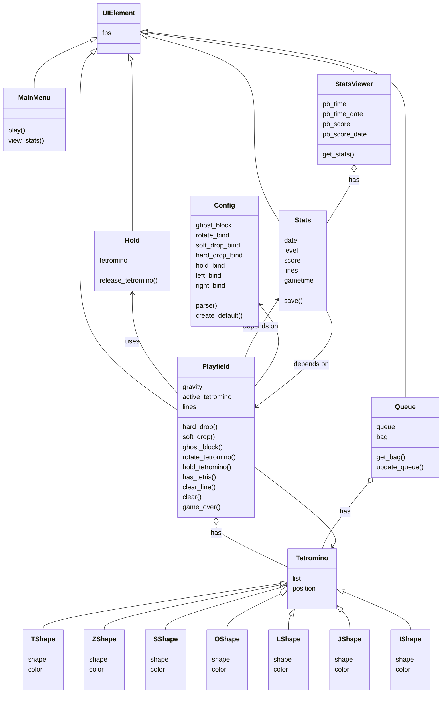

# Tetris in Python

A simple TUI implementation of Tetris made in Python.

## Planned features

- barebones Tetris

- per-game stat tracking and saving them to a database (SQLite)

  - stat viewer

- JSON configuration file for setting simple settings (controls, ghost block)

## UML chart (WIP)

## Expected external dependencies:

- Windows:

  - [windows-curses](https://pypi.org/project/windows-curses/)

- Linux:

  - none

## Resources

- [Tetris Guideline](https://tetris.wiki/Tetris_Guideline)

- [curses howto](https://docs.python.org/3/howto/curses.html)

- https://en.wikipedia.org/wiki/Box-drawing_characters
